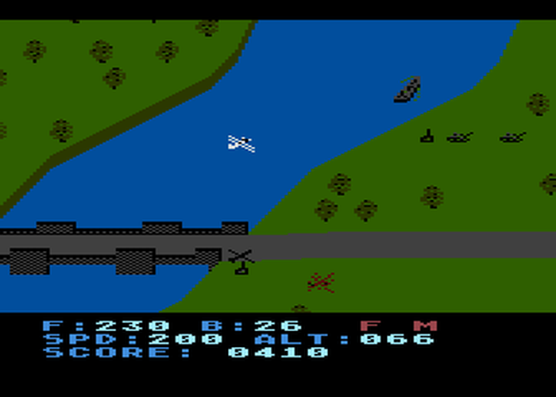
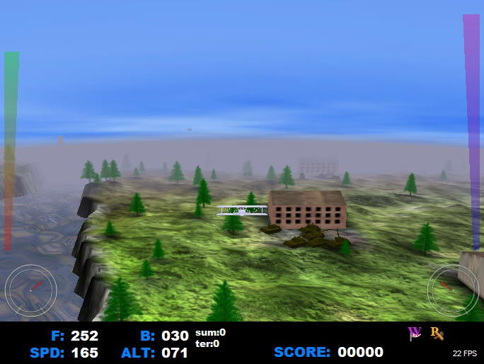

# Blue Max 3D

A 3D remake of an old classic game known from the 8-bit computers.

Created by `Grzegorz Drozd`, long time ago... 

# Quick introduction

 

Blue Max was an isometric bi-plane shooter for the 8-bit computers like Atari, Commodore 64 or ZX Spectrum. Some people said it was a 3D River Raid but Blue Max was much more than simple shooter. The player could land on runway, fly over river, land, bridges or city. The enemies were in the planes, tanks, boats or cars on the road.
If you want to know more, just look at this [video from the original game](https://www.youtube.com/watch?v=dNbr7XYsLTU).

# This game

This is my attempt to create a remake of Blue Max with real 3D graphics. It should give you the feel like the original game but with some improvements.

At first take a look at [this video](https://www.youtube.com/watch?v=_lxEZBy9l60).

# The code

The game is in pretty advanced state but it's unfinished. I left the project many years ago and I don't plan to return to it. The code is very messy. I was learning the use OpenGL but also C++. So I made many mistakes that are difficult to be undone today. Actually the whole code should be written again, because it's a total crap. I have no idea how this game still work with such a bad code.

That's why I give the game to the world. If you want to learn something here, probably you will not find anything interesting. If you want to finish the game, you're very welcome, but I doubt it. If you just want to play the game, it would be better to download the compiled and working game from [my website](https://gadz.pl/opis.php?i=352).

# Compilation

The code was made using Borland C++ Builder. It should compile in it. BCB should be available to download as a free version for home developers, but rather much newer version than I used back in the day. It is possible that after some improvements it would compile in an other compiler, but I really don't know it. You can try whatever you want to.

# Third party components

I used some free components and uploaded them in this repository only because they are also pretty old and probably you couldn't find it anywhere today. I left all licenses, copyrights and whatever was added to these files.

- FMOD
  - Copyright (c), Firelight Technologies Pty, Ltd. 1999-2004.
  - header files
  - fmod.dll
- lrtimer
  - Written by Max Gurdziel 2005 under GNU General Public License
  - header and source cpp file

---

Grzegorz "GAD" Drozd, vel GadZombie 
